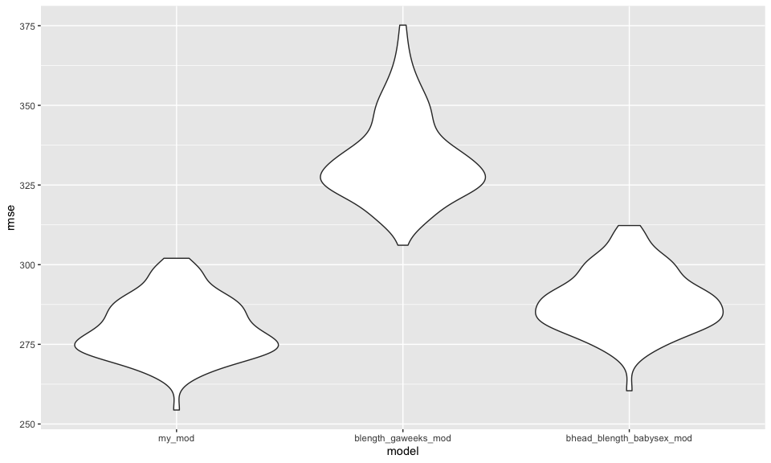

p8105_hw6_td2749
================
Tvisha R. Devavarapu
2022-11-22

``` r
library(tidyverse)
library(ggplot2)
library(modelr)
library(mgcv)
library(patchwork)

knitr::opts_chunk$set(
  fig.width = 10,
  fig.asp = .6,
  out.width = "90%")
```

# Problem 2

``` r
homicide_data = 
  read_csv("./data/homicide-data.csv") %>%
  janitor::clean_names() %>% 
  unite(city_state, c(city, state), sep = ",", remove = FALSE) %>% 
  mutate(
    resolved = ifelse(disposition == "Closed by arrest", 1, 0),
    victim_age = as.numeric(victim_age),
    victim_sex = as.factor(victim_sex)) %>% 
  filter(
    !(city_state %in% c("Dallas,TX", "Phoenix,AZ", "Kansas City,MO", "Tulsa,AL")),
    victim_race %in% c("White", "Black")) %>% 
  mutate(
    victim_race = as.factor(victim_race))
```

    ## Rows: 52179 Columns: 12
    ## ── Column specification ────────────────────────────────────────────────────────
    ## Delimiter: ","
    ## chr (9): uid, victim_last, victim_first, victim_race, victim_age, victim_sex...
    ## dbl (3): reported_date, lat, lon
    ## 
    ## ℹ Use `spec()` to retrieve the full column specification for this data.
    ## ℹ Specify the column types or set `show_col_types = FALSE` to quiet this message.

    ## Warning in mask$eval_all_mutate(quo): NAs introduced by coercion

``` r
head(homicide_data)
```

    ## # A tibble: 6 × 14
    ##   uid        repor…¹ victi…² victi…³ victi…⁴ victi…⁵ victi…⁶ city_…⁷ city  state
    ##   <chr>        <dbl> <chr>   <chr>   <fct>     <dbl> <fct>   <chr>   <chr> <chr>
    ## 1 Alb-000003  2.01e7 SATTER… VIVIANA White        15 Female  Albuqu… Albu… NM   
    ## 2 Alb-000005  2.01e7 MULA    VIVIAN  White        72 Female  Albuqu… Albu… NM   
    ## 3 Alb-000006  2.01e7 BOOK    GERALD… White        91 Female  Albuqu… Albu… NM   
    ## 4 Alb-000009  2.01e7 MARTIN… GUSTAVO White        56 Male    Albuqu… Albu… NM   
    ## 5 Alb-000012  2.01e7 LUJAN   KEVIN   White        NA Male    Albuqu… Albu… NM   
    ## 6 Alb-000016  2.01e7 GRAY    STEFAN… White        43 Female  Albuqu… Albu… NM   
    ## # … with 4 more variables: lat <dbl>, lon <dbl>, disposition <chr>,
    ## #   resolved <dbl>, and abbreviated variable names ¹​reported_date,
    ## #   ²​victim_last, ³​victim_first, ⁴​victim_race, ⁵​victim_age, ⁶​victim_sex,
    ## #   ⁷​city_state

**Note**: In the `homicide_data` df, column `resolved` indicates the
case status. Cases that are closed by arrest (solved cases) are
represented by 1 and cases that are open/no-arrest and closed without
arrest (unsolved cases) are represented by 0.

``` r
balt_log_fit = 
  homicide_data %>% 
  filter(
    city_state == "Baltimore,MD") %>% 
  glm(resolved ~ victim_age + victim_sex + victim_race, data = ., family = binomial())

balt_log_fit_table = broom::tidy(balt_log_fit)

balt_log_fit_table %>% 
  mutate(OR = exp(estimate)) %>%
  select(term, log_OR = estimate, OR, p.value) %>% 
  knitr::kable(digits = 3)
```

| term             | log_OR |    OR | p.value |
|:-----------------|-------:|------:|--------:|
| (Intercept)      |  0.310 | 1.363 |   0.070 |
| victim_age       | -0.007 | 0.993 |   0.043 |
| victim_sexMale   | -0.854 | 0.426 |   0.000 |
| victim_raceWhite |  0.842 | 2.320 |   0.000 |

``` r
male_vic_OR = exp(coef(balt_log_fit))[["victim_sexMale"]]
male_vic_OR_lower = exp(confint(balt_log_fit, "victim_sexMale"))[[1]]
```

    ## Waiting for profiling to be done...

``` r
male_vic_OR_upper = exp(confint(balt_log_fit, "victim_sexMale"))[[2]]
```

    ## Waiting for profiling to be done...

**OR**: 0.4255117

**95% Confidence Interval**: (0.3241908, 0.5575508)

The above odds ratio indicates that controlling all other variables, the
odds of a homicide being solved is \~57.4% lower (between 44.2% and
67.6%) for a male victim compared to a female victim (in the case of
Baltimore, MA between 2007 and 2017).

``` r
hom_all_glm = 
  homicide_data %>% 
  nest(data = -city_state) %>% 
  mutate(
    models = map(.x = data, ~glm(resolved ~ victim_age + victim_sex + victim_race, data = .x, family = binomial())),
    ci = map_df(.x = models, ~confint(object = .x, parm = "victim_sexMale")), 
    results = map(models, broom::tidy)) %>% 
  select(-data, -models) %>% 
  unnest(results) %>% 
  unnest(ci) %>% 
  filter(term == "victim_sexMale") %>% 
  mutate(OR = exp(estimate),
         ci_lower = exp(`2.5 %`),
         ci_upper = exp(`97.5 %`)) %>% 
  select(city_state, term, OR, ci_lower, ci_upper)

head(hom_all_glm)
```

    ## # A tibble: 6 × 5
    ##   city_state     term              OR ci_lower ci_upper
    ##   <chr>          <chr>          <dbl>    <dbl>    <dbl>
    ## 1 Albuquerque,NM victim_sexMale 1.77     0.825    3.76 
    ## 2 Atlanta,GA     victim_sexMale 1.00     0.680    1.46 
    ## 3 Baltimore,MD   victim_sexMale 0.426    0.324    0.558
    ## 4 Baton Rouge,LA victim_sexMale 0.381    0.204    0.684
    ## 5 Birmingham,AL  victim_sexMale 0.870    0.571    1.31 
    ## 6 Boston,MA      victim_sexMale 0.674    0.353    1.28

``` r
male_female_odds_plot = 
  hom_all_glm %>%
    ggplot(aes(x = reorder(city_state, OR), y = OR)) +
      geom_point() +
      geom_errorbar(aes(ymin = ci_lower, ymax = ci_upper)) +
      labs(title = "Comparative Odds: Solved Homicides of Male Victims in reference to Female Victims",
           x = "Location (City and State)",
           y = "Comparative Odds",
           caption = "Comparative odds of solved homicides of male victims in reference to female victims with associated 95% confidence intervals between 2007 and 2017 in major US cities.") +
      theme(plot.title = element_text(hjust = 0.5, face = "bold"),
            plot.caption = element_text(hjust = 0.5),
            axis.title = element_text(face = "bold"),
            axis.text.x = element_text(angle = 70, hjust = 1))

male_female_odds_plot
```


**Comment**: Based on the fit model, compared to female homicide victim
cases, amongst major US cities, male homicide victim cases have much
fewer odds to be solved in New York, NY and considerably higher odds in
Albuquerque, NM. In Atlanta, GA and Richmond, VA, male and female
homicide victim cases are equally likely to be solved (equal odds \~1).
In most of the major US cities included in this analysis, cases with
male homicide victims are comparatively (in reference to cases with
female homicide victims) less likely to be solved. Only in 4 cities here
(Nashville TN, Fresno CA, Stockton CA, Albuquerque NM) here, cases with
male homicide victims have higher odds of being solved.

Note: In this context, it is important to consider that odds ratios are
a relative and not an absolute measure of pointing out the differences.
For instance, hypothetically, if it is the case that Albuquerque has
very few female homicide victims and a low solving rate for female
victims, the overall odds ratio would tend to be over-inflated, thereby
casting doubt upon the validity of relative measures with extreme
underlying contexts.

# Problem 3

``` r
birthweight_data = 
  read_csv("./data/birthweight.csv") %>%
  janitor::clean_names() %>% 
  mutate(
    babysex = as.factor(babysex),
    frace = as.factor(frace),
    malform = as.factor(malform),
    mrace = as.factor(mrace))
```

    ## Rows: 4342 Columns: 20
    ## ── Column specification ────────────────────────────────────────────────────────
    ## Delimiter: ","
    ## dbl (20): babysex, bhead, blength, bwt, delwt, fincome, frace, gaweeks, malf...
    ## 
    ## ℹ Use `spec()` to retrieve the full column specification for this data.
    ## ℹ Specify the column types or set `show_col_types = FALSE` to quiet this message.

- There are no missing values in this dataset (0).

I have decided to use the following variables as main effects for my
model:

- `mrace`: categorical; (1 = White, 2 = Black, 3 = Asian, 4 = Puerto
  Rican, 8 = Other)
- `bhead`: continuous; (baby’s head circumference at birth
  (centimeters) - ranging from 20 to 42 cm.)
- `blength`: continuous; (baby’s length at birth (centimeteres) -
  rannging from 20 to 65 cm.)
- `babysex`: categorical; (baby’s sex (male = 1, female = 2))
- `smoken`: continuous; (average number of cigarettes smoked per day
  during pregnancy - ranging from 0 to 60.)

Following a hypothesized structure, I have included the size of the
baby’s head, length at birth, and gender at birth to encompass
potentially influential physiological aspects. From the mother’s
perspective, I have decided to include race and smoking status as they
are often cited to be instrumental in determining the baby’s physique at
birth.

Here are some exploratory graphs displaying basic underlying 1x1 trends:

``` r
head_bwt = 
  birthweight_data %>% 
  ggplot(aes(x = bhead, y = bwt)) +
  geom_point(aes(alpha = 0.1, color = mrace))

length_bwt = 
  birthweight_data %>% 
  ggplot(aes(x = blength, y = bwt)) +
  geom_point(aes(alpha = 0.1, color = mrace))

smoken_bwt = 
  birthweight_data %>% 
  ggplot(aes(x = smoken, y = bwt)) +
  geom_point(aes(alpha = 0.1, color = mrace))  

head_bwt + length_bwt + smoken_bwt
```


``` r
my_model = 
  birthweight_data %>% 
  lm(bwt ~ mrace + bhead + blength + babysex + smoken, data = .)

summary(my_model)
```

    ## 
    ## Call:
    ## lm(formula = bwt ~ mrace + bhead + blength + babysex + smoken, 
    ##     data = .)
    ## 
    ## Residuals:
    ##      Min       1Q   Median       3Q      Max 
    ## -1139.33  -186.27    -8.09   179.30  2504.97 
    ## 
    ## Coefficients:
    ##               Estimate Std. Error t value Pr(>|t|)    
    ## (Intercept) -5650.1849    99.6340 -56.709  < 2e-16 ***
    ## mrace2       -145.4771     9.3965 -15.482  < 2e-16 ***
    ## mrace3       -115.0226    43.3026  -2.656  0.00793 ** 
    ## mrace4       -144.8508    19.1264  -7.573 4.42e-14 ***
    ## bhead         142.1479     3.4426  41.291  < 2e-16 ***
    ## blength        81.4521     2.0254  40.215  < 2e-16 ***
    ## babysex2       38.4275     8.6504   4.442 9.12e-06 ***
    ## smoken         -4.0007     0.5997  -6.671 2.85e-11 ***
    ## ---
    ## Signif. codes:  0 '***' 0.001 '**' 0.01 '*' 0.05 '.' 0.1 ' ' 1
    ## 
    ## Residual standard error: 280.3 on 4334 degrees of freedom
    ## Multiple R-squared:  0.701,  Adjusted R-squared:  0.7005 
    ## F-statistic:  1451 on 7 and 4334 DF,  p-value: < 2.2e-16

As revealed in the summary above, every predictor in this case seems to
have a statistically significant effect on the response value (birth
weight).

The considerably high r^2 value: 0.7005 indicates that most of the
variance in the response value can be explained by the variance in the
predictors.

*Plot: Residuals Vs. Fitted Values*

``` r
birthweight_data %>% 
  select(mrace, bwt, bhead, blength, babysex, smoken) %>% 
  modelr::add_residuals(., my_model) %>% 
  modelr::add_predictions(., my_model) %>% 
    ggplot(aes(x = pred, y = resid)) +
    geom_point(aes(alpha = 0.1)) +
    geom_hline(yintercept = 0)
```


*Analysis*: The model seems to doing fairly well. Apart from some
outliers, most values are equally spread out about the y = 0 line. Based
on the x-axis scale, there seems to be a cluster indicating that most of
the fitted values lie between 2000 and 4000 grams (2 kg - 4 kg) which
makes sense in terms of baby birth weights.

``` r
# One using length at birth and gestational age as predictors (main effects only)
blength_gaweeks_fit = 
  birthweight_data %>% 
  lm(bwt ~ blength + gaweeks, data = .)

summary(blength_gaweeks_fit)
```

    ## 
    ## Call:
    ## lm(formula = bwt ~ blength + gaweeks, data = .)
    ## 
    ## Residuals:
    ##     Min      1Q  Median      3Q     Max 
    ## -1709.6  -215.4   -11.4   208.2  4188.8 
    ## 
    ## Coefficients:
    ##              Estimate Std. Error t value Pr(>|t|)    
    ## (Intercept) -4347.667     97.958  -44.38   <2e-16 ***
    ## blength       128.556      1.990   64.60   <2e-16 ***
    ## gaweeks        27.047      1.718   15.74   <2e-16 ***
    ## ---
    ## Signif. codes:  0 '***' 0.001 '**' 0.01 '*' 0.05 '.' 0.1 ' ' 1
    ## 
    ## Residual standard error: 333.2 on 4339 degrees of freedom
    ## Multiple R-squared:  0.5769, Adjusted R-squared:  0.5767 
    ## F-statistic:  2958 on 2 and 4339 DF,  p-value: < 2.2e-16

``` r
# One using head circumference, length, sex, and all interactions (including the three-way interaction) between these
bhead_blength_babysex_fit = 
  birthweight_data %>% 
  lm(bwt ~ bhead + blength + babysex + bhead*blength*babysex, data = .)

summary(bhead_blength_babysex_fit)
```

    ## 
    ## Call:
    ## lm(formula = bwt ~ bhead + blength + babysex + bhead * blength * 
    ##     babysex, data = .)
    ## 
    ## Residuals:
    ##      Min       1Q   Median       3Q      Max 
    ## -1132.99  -190.42   -10.33   178.63  2617.96 
    ## 
    ## Coefficients:
    ##                          Estimate Std. Error t value Pr(>|t|)    
    ## (Intercept)            -7176.8170  1264.8397  -5.674 1.49e-08 ***
    ## bhead                    181.7956    38.0542   4.777 1.84e-06 ***
    ## blength                  102.1269    26.2118   3.896 9.92e-05 ***
    ## babysex2                6374.8684  1677.7669   3.800 0.000147 ***
    ## bhead:blength             -0.5536     0.7802  -0.710 0.478012    
    ## bhead:babysex2          -198.3932    51.0917  -3.883 0.000105 ***
    ## blength:babysex2        -123.7729    35.1185  -3.524 0.000429 ***
    ## bhead:blength:babysex2     3.8781     1.0566   3.670 0.000245 ***
    ## ---
    ## Signif. codes:  0 '***' 0.001 '**' 0.01 '*' 0.05 '.' 0.1 ' ' 1
    ## 
    ## Residual standard error: 287.7 on 4334 degrees of freedom
    ## Multiple R-squared:  0.6849, Adjusted R-squared:  0.6844 
    ## F-statistic:  1346 on 7 and 4334 DF,  p-value: < 2.2e-16

Make this comparison in terms of the cross-validated prediction error;
use crossv_mc and functions in purrr as appropriate.

``` r
cv_df = 
  crossv_mc(birthweight_data, 100)

cv_df =
  cv_df %>% 
  mutate(
    train = map(train, as_tibble),
    test = map(test, as_tibble))

cv_df = 
  cv_df %>% 
  mutate(
    my_mod = map(train, ~lm(bwt ~ mrace + bhead + blength + babysex + smoken, data = .x)),
    blength_gaweeks_mod = map(train, ~lm(bwt ~ blength + gaweeks, data = .x)),
    bhead_blength_babysex_mod = map(train, ~lm(bwt ~ bhead + blength + babysex + bhead*blength*babysex, data = .x))) %>% 
  mutate(
    rmse_my_mod = map2_dbl(my_mod, test, ~rmse(model = .x, data = .y)),
    rmse_blength_gaweeks_mod = map2_dbl(blength_gaweeks_mod, test, ~rmse(model = .x, data = .y)),
    rmse_bhead_blength_babysex_mod = map2_dbl(bhead_blength_babysex_mod, test, ~rmse(model = .x, data = .y)))
```

``` r
cv_df %>% 
  select(starts_with("rmse")) %>% 
  pivot_longer(
    everything(),
    names_to = "model", 
    values_to = "rmse",
    names_prefix = "rmse_") %>% 
  mutate(model = fct_inorder(model)) %>% 
  ggplot(aes(x = model, y = rmse)) + geom_violin()
```



Based on the results of the cross validation, my model seems to be doing
slightly better than the `bhead_blength_babysex_fit`. It has a low RMSE.
